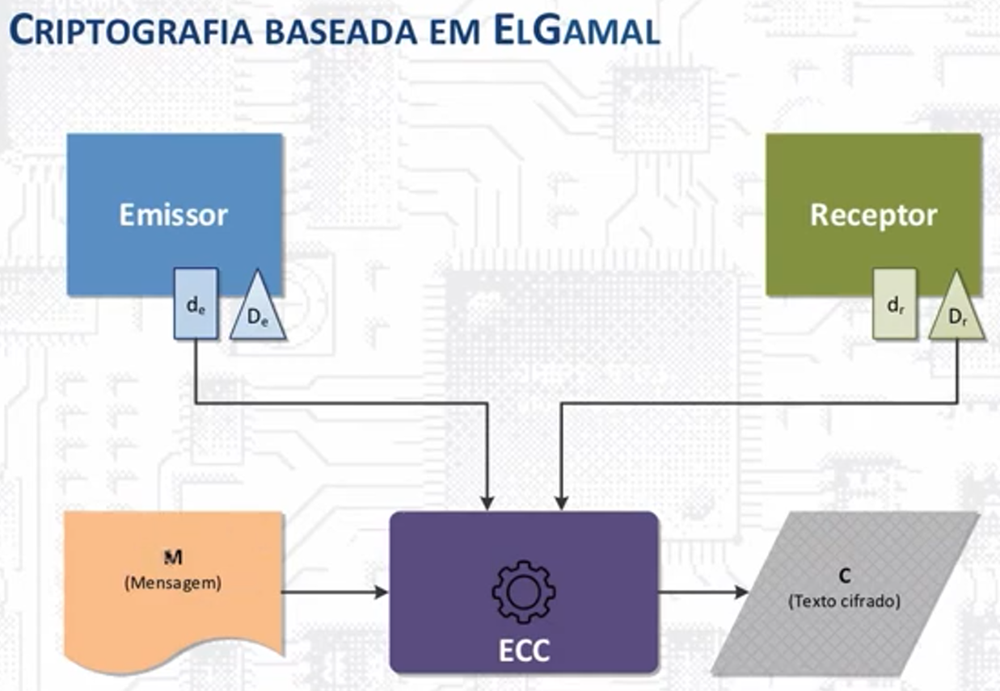
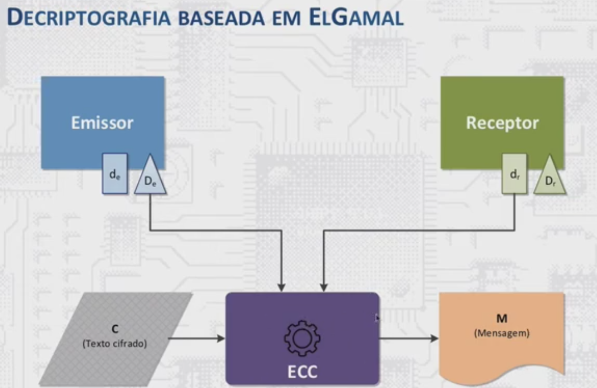

# Criptografia de Curvas Elipticas - CCE

Atualmente há outro algoritmo de criptografia assimétrica que utiliza chaves muito menores tornando o algroritmo fortemente indicado para sistemas com pouco recurso computacional como IoT e mobiles, é a respeito deste algoritmo que vou escrever a partir de agora.

## ECC - Ellipitcs Curves Cryptograpy (Criptografia de Curvas Elípticas)

Para despertar o teu interesse em aprender ECC e começar a usar em suas aplicações já vou fazendo algumas comparações com RSA

#### RSA x ECC

| Característica | RSA | ECC | Quem Ganha? |
| :---|:---:| :---: |---:|
| Tamanho Chave |Grande (2024 a 4098 bits) | Pequena (256 a 384 bits) | ECC (chaves menores)|
| Velocidade de Cifragem | Muito rápida | rápida | RSA |
| Velocidade Decifragem | Lenta/Pesada | Muito rápida | ECC |
| Consumo de Banda/Memória | Alto (Pacotes maiores)| Muito Baixo | ECC |
| Compatibilidade Legada | universão (sistemas antigos) | Alta (mas não universão) | RSA |

#### Nota de Segurança

Uma chave ECC de 256 bits oferece o mesmo nível de segurança que uma chave RSA de 3072 bits. Isto significa menos dados trafegando na rede e menos processamento para dispositivos `IoT`, `Móveis` e `Sistemas Embarcados`.

Outra boa notícia, para aplicações de Chat, o compartilhamento da chave pública também pode acontecer por meio do algoritmo Diffie-Hellman com Curvas Elípticas - ECDH.

*Uma outra vantagem do algoritmo ECC em relação ao RSA*: Como as chaves são trocadas constantemente há a garantia de que mensagens antigas não sejam lidas mesmo se o aparelho for invadido no futuro (Forward Secrecy).

#### O Fluxo do Handshake ECC (ECDH)

1. O usuário A envia sua Chave Pública Elíptica (CPE) ao usuário B;
2. O usuário B, em vez de cifrar algo, gera seu próprio par de chaves elipticas temporárias e envia sua CPE para o usuário A;
3. **A mágica:** Agora o usuário A pega a CPE do usuário B + sua própria Chave Privada e calcula um ponto na curva. O usuário B faz o mesmo com a CPE do usuário.
4. A partir desse ponto indêntico gerado em ambos os lados, eles derivam a chave AES.

**Vantagem Crucial:** Se um hacker interceptar tudo na rede (as duas CPEs), não consegue calcular o ponto comum.

Agora fica a tua pergunta: O que é esse ponto Comum?

#### Como funciona a Matemática no ECC?

No ECC, não se utiliza a fatoração, mas *de curvas elípticas sobre **corpos finitos***.

Mas o que é campo finito? É o conjunto composto por um número finito de elementos.

Mas para a criptografia ECC o que interessa é o campo finito $\mathbb{F}_p$ que é um conjunto de inteiros módulo p, onde $p$ é um número primo.

O conjunto de inteiros módulo $p$ consiste em todos os inteiros de 0 a $p-1$ e suas operações matemáticas são feitas em aritmética modular.

- $a = b \mod  n$, sendo $a$ o resto da divisão de $b$ por $n$.

- Exemplos: $2 = 38 \mod 12$, pois 38/12 = 3, mas o que interessa no cálculo é o resto desta divisão, que é 2.

**Curvas elípticas**

São o conjunto $(x, y)$ que satisfazem a equação:

$y^2\mod p = x^3 + ax + b,\hspace{.1cm}com\hspace{.1cm}4a^3 + 27b^2 \neq 0 \mid a, b, x\hspace{.1cm} e\hspace{.1cm}y\in\mathbb{F}_p$
adicionado o ponto especial $O$ no infinito.

$4a^3 + 27b^2 \neq 0$ são as curvas elipticas singulares, necessário excluir pois não trazem um bom resultado para criptografia.

Outra característica importante é a escolha do ponto $G$, que possui uma ordem $N$ e um cofator $h$.

Quanto maior for p, maior a quantidade de pontos na curva eliptica e maior a dificuldade para mapear a mensagem para um invasor.

O que garante a segurança da criptografia de curvas elipticas é o problema do logaritmo discreto, que já falamos na [teoria de criptografia assimétrica](teoria_assimetrica.md).

**Problema de Logaritimos Discretos Para Curvas Elipticas (DLP)**

- Conhecidos $P$ e $Q$, encontrar $k$ tal que $Q = kP$.
- No caso do campo finito $\mathbb{F_p}$, conhecidos $a$ e $b$, encontrar $k$ tal que $b = a^k \mod p$.

Acredita-se que não há um algoritmo de tempo polinomial que rode em um computador clássico para resolvê-lo. Mas não há prova matemática para isso.

Outro detalhe interessante é que é possível definir uma operação matemática de "adição de Pontos" na curva, de modo que traçando uma reta por esses pontos encontra-se um terceiro ponto na curva, rebatendo esse terceiro ponto no eixo $X$ e o resultado é o ponto R, onde:

$$P + Q = R$$

Caso some-se um ponto P com ele mesmo, estamos traçando uma reta tangente ao ponto P. Ou seja é possível ao invés de escolher dois pontos distintos traçar a tangente a um único ponto e obter: P + P = 2P (multiplicação escalar).

**Na Prática**

Agora utilizamos o problema do Logaritmo Discreto em Curvas Elípticas (ECDLP). A criptografia acontece quando é escolhido um **Ponto Gerador (G)**.

**Chave Privada** é simplesmente um número inteiro aleatório gigantesco em bits que chamaremos de **`k`**.

**Chave Pública `K`** é o ponto resultante de somar o ponto *G* a ele mesmo *k* vezes:

$$K = k \times G$$

Aqui mora o segredo da engenharia de segurança:

- Se eu te der o número k (chave privada) e o G, é extremamente fácil e rápido para o computador calcular o ponto final K. Importante você lembrar que G é um ponto no plano e possui coordenadas (x, y), k é um número inteiro em bits.
- Entretanto, se eu te der G e K **é matematicamente impossível** até para computadores atuais, decobrir quantas vezes o ponto  G foi somado $(k)$. Não existe "divisão" de pontos na curva elíptica. A única forma de descobrir o k seria  testar um número por um por força bruta que levaria bilhões de anos.

**Criptografar uma mensagem**



Para criptografar uma mensagem o `emissor` e o `receptor` trocam entre si suas chaves públicas, que podem ser transmitidas livremente pela rede. Então o emissor usa sua chave privada e a chave pública do receptor e calcula a mensagem criptografada:

$$C = M + k_eK_r$$
onde,

- C é a mensagem criptografada
- M é a mensagem original
- $k_e$ é a chave privada do emissor
- $K_r$ chave pública receptor.

Para descriptografar a mensagem um processo semelhante acontece.


O receptor procede com a operação inversa, se o emissor somou a mensagem ao produto das chaves Pública e Privada, agora deve-se realizar a subtração.

$$M = C - k_rK_e$$

onde:

- M é a mensagem descriptografada
- C é a mensage criptografada
- $k_r$ chave privada receptor
- $K_e$ chave pública emissor

**Por que isso funciona e como saber se M do lado emissor é a mesma M do lado do receptor?**

$$M = C - k_rK_e$$
$$= (M + k_eK_r) - k_rK_e$$
$$= (M + k_e(k_rG)) - k_r(k_eG)$$
$$= M + k_e(k_rG) - k_e(k_rG)$$
uma vez que $k_e(k_rG) = k_e(k_rG)$, resulta em apenas $M$.

Percebe-se matematicamente que é possível recuperar a mensagem original.

### Exemplo Prático Comunicação de Alice e Bob

Para o mundo real as curvas seguras e padronizadas já foram escolhidas:

- Curvas NIST
- Curve25519 (projetado para uso com o esquema de acordo de chave ECDH)
- secp256k1 (suado em Bitcoin e outras criptomoedas)
- Curvas de Brainpool (oferece uma alternativa às curvas NIST)

**INTERESSANTE!** sE você usa chave ssh do github para subir seus commits, talvez você já tenha reparado que a transmissão dos dados para o github os dados são criptografados utilizando a curva25519?

Quando fizer o push que for pedido para digitar a senha, observe a instrução que aguarda sua senha:

```bash
Enter passphrase for key '/c/Users/.../.ssh/id_ed25519': # é isso mesmo $id_ed25519
```

**Importante:** Não tente criar do zero a sua curva de criptografia, isso pode gerar vulnerabilidades em seu algoritmo de segurança.

Como as duas curvas mais famosas são: secp256k1 (blockchain) e X25519 (IoT e WhatsApp), vamos usar em nosso exemplo a X25519.

Primeiro vamos simular o Handshake entre Alice e Bob.

Configuração Pública:
Alice gera uma chave pública e Bob gera outra.

- Uma curva elíptica qualquer
- Ponto Gerador (G): É um ponto específico na curva (ex: coordenadas x=5, y=3).

**Passo 1:** Geração das Chaves

**Alice cria suas chaves:**

- Ela escolhe um número secreto aleatório (sua chave privada $k_A$)
$$k_A = 4$$

- Calcula a sua chave pública ($K_A$), que significa somar o ponto G a ele mesmo 4 vezes.
$$K_A = 4 \times G$$

- Ela envia o ponto $K_A$ para Bob.

**Bob cria suas chaves:**

- Escolhe o próprio número secreto aleatório (chave privada $k_B$)
$$k_B = 7$$

- Calcula sua chave pública:
$$K_B = 7 \times G$$

- Bob envia sua chave pública para Alice.

Supondo que um hacker intercepte esta comunicação ele sabe o $K_A$, $K_B$, o $G$ mas não sabe os números secretos $k_A$ e $k_B$. Então de nada adianta.

**Passo 2:** Calculo do segredo compartilhado (AES) que é um terceiro ponto que ao traçar uma reta de $k_rG$ e $k_eG$ passa pelo ponto $S$ (segredo)

- Alice faz:
$$S = k_A \times K_B$$
$$S = 4 \times (7 \times G)$$
$$S = 28 \times G$$

- Bob faz:
$$S = k_B \times K_A$$
$$S = 7 \times (4 \times G)$$
$$S = 28 \times G$$

Ambos chegaram exatamente no mesmo ponto na curva: $28 \times G$ (o ponto G somado 28 vezes).

Para finalizar, tempos o ponto com coordenadas x e y. Pegam, por exemplo apenas a coordenada x, que é uma sequência de bits, jogam em uma função de hash (como SHA-256) e pronto, temos a chave simétrica AES para usar no chat.

Agora escovando um pouco os bits para a chave simétrica AES.
Há uma estrutura específica, para impedir que hackers explorem fraquezas, os 256 bits da chave privada $k$ passam por uma limpeza, um processo de `clamping` antes de serem usados:

- o bit mais significativo é forçado a ser `1`;
- os 3 bits menos significativos são forçados a ser `000`.

Isso significa que a chave privada $k$ é um número que o bit mais à esquerda é sempre `1` seguido de 252 bits aleatórios, concluído com 3 bits à direita que são sempre `000`.

```plaintext
  byte 1     byte 2        byte 31    byte 32
[1#######] [########] ... [########] [#####000]
 ^                               ^
 |                               |
 Bit mais significativo       3 bits menos significativos
```

## Outro uso para Criptografia de Curvas Elipticas

Uma aplicação muito utilizada para ECC é o algoritmo de Assinaturas Digitais - ECDSA. Este algoritmo permite que um usuário verifique a autenticidade do emissor através do conhecimento da sua chave pública.

**Como isso acontece?**

Dados enviados pelo emissor:

- Aplica-se uma função hash da mensagem representada como um número inteiro ($\mathbb{z}$), que pode ser truncado.
- Escolhe-se um número inteiro $k$ aleatóriamente entre 0 e n-1 (n-1 é a orgem de G)
- Calcula-se o ponto $P = kG = (x_p, y_p)$ e $r = x_p\mod n \neq 0$
- calcula-se $s=k^{-1}(z+rd_e)\mod n \neq 0$.
- $(r, s)$ é a assinatura do emissor.

Como o receptor verifica a assinatura?

- Calcula-se o inteiro $u_1=s^{-1}z\mod n$
- Calcula-se o inteiro $u_2 = s^{-1}r \mod n$
- Calcula-se o ponto $P = u_1G + u_2K_e = (x_p, y_p)$
- A assinatura é válida se $r$ = $x_p \mod n$

## Como aplicar isso?

Olha só que legal, pode usar a própria biblioteca Python `cryptography` para isso, logo a seguir mostrarei um código simples para teste.

**Em Breve subirei o código do script de teste**
