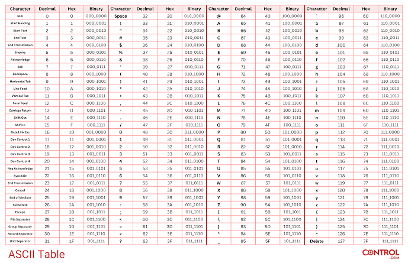

## Mas como os pares de chaves são gerados?

Inicialmente 3 números são gerados aleatoriamente, vamos chamar esses números de *e*, *p* e *q*. O *e* é o número que fará parte da chave pública e *p* e *q* farão parte da chave privada.

Como fazer com que exista uma relação entre *e*, *p* e *q*?

Um número *n* é gerado e com ele é obtida a chave pública ao relacioná-lo com expoente *e*. Mas de onde surge esse *n* e de onde surge *e*?

Ao fazer $p \times q = n$, deste modo, *n* é um número composto, que podemos chamá-lo de número semiprimo, pois é  dependente de *p* e *q* dois números primos. Logo a chave pública e a chave privada estão relacionadas entre si.

A geração do expoente *e* segue um:

1 - Deve ser maior que 1 e menor que Totiente. `Totiente`? Sim, a função Totiente também é conhecida como função de Euler.

Esta função é definida como a quantidade de números inteiros co-primos com um número $n$ entre $1$ e esse $n-1$

Vou fugir aqui de uma explicação matemática mais profunda e vou direto a um exemplo que torne o conceito fácil de entender.

Por exemplo,

```Matemática
Suponha que queira encontrar a quantidade de coprimos de 8.
Então pegamos os números entre 1 e 8 e vejamos possuem como divisor comum apenas o 1.
```

Entenda o que são números coprimos com o exemplo abaixo:

8 e 9, apesar de serem números compostos, são copirmos entre si?
Chamaremos o conjunto dos divisores de 8 de $D_8$ e os divisores de 9 de $D_9$

Temos:
$$D_8 = { 1, 2, 4, 8}$$
$$D_9 = { 1, 3, 9 }$$

Para os conjuntos acima vemos que a interseção
$$D_8 \cap D_9 = {1}$$

A função $\phi$ ou Função de Euler (pronuncia-se Óiler) retorna a quantidade de números coprimos de n entre 1 e n.

Veja agora o cálculo da função phi para o número 8

| Par | É coprimo de 8? |
|:---:|:---:|
| 1 | Sim |
| 2 | Não, pois 2 é divisor de 8|
| 3 | Sim |
| 4 | Não, pois 4 é divisor de 8 |
| 5 | Sim |
| 6 | Não, pois 2 é divisor de 6 e 8|
| 7 | Sim |

Assim $\phi(8) = 4$

Um atalho, para n composto, $\phi(n) = \phi(p^k) = p^k - p^{k-1}$
O que esta notação significa?

$\phi(8) = \phi(2^3) = 2^3 - 2^{3-1} = 8 - 4 = 4$

Agora quando n for primo é o que importa para a criptografia RSA.

$\phi(n) = n - 1$

Agora finalmente sabemos como calcula-se *e* da chave pública.

Primeira regra, estar entre 1 e Totiente de n (que é o produto entre p e q)
Segunda regra, ser coprimo do Totiente.

Então para um exemplo válido, n deve ser o produto entre 2 números primos. Então supomos: p = 3 e q = 5. Desta forma n = 15;

$\phi(15) = (p - 1)(q - 1) = (3-1)(5-1) = 2 * 4 = 8$

Então a escolha para o expoente *e* precisa ser um número entre 1 e 8 que sejam coprimos, assim os possíveis números podem ser: {1, 3, 5, 7}, assim sendo o nº 3 pode ser a escolha para o expoente.

## Mas como uma mensagem é cifrada?

Para nossa mensagem de estudos vamos pensar em p e q números primos 233 e 347 respectivamente.

| chave pública | mensagem | chave privada
| :---:|:---:|:---:|
| e = 3, n = 80851 | O (original) | p = 233
| | C (cifrada)|  q = 347 |

Para esses valores encontramos um $\phi(n) = \phi(80851) = 80272$

**A escolha do expoente *e***:

O número 3 funciona, pois o Máximo Divisor Comum entre 3 e 80272 é 1.

**Cálculo da mensagem cifrada**
$$O^e mod (n) \equiv C$$

**Cálculo da mensagem decifrada**
$$C^d mod (n) \equiv O$$

Agora vamos conhecer aqui a tabela ASCII, pois a mensagem original e a mensagem decifrada utilizarão a mesma tabela, para os cálculos.



A tabela acima traz uma conversão dos bytes utilizados para representar cada caractere do idioma em números inteiros.
Vamos supor que a `Alice` quer enviar a mensagem "Oi" para o `Bob`, como essa mensagem será cifrada?

**O envio de mensagem**

Nós já sabemos que *e* e *n* compõem a chave pública e isso quer dizer que não é segredo para ninguém. Então Bob gera o *e* e o *n* e compartilha com Alice.

Do lado de Alice a mensagem oi é codificada da seguinte forma

| Mesagem original (O) | Mensagem original ASCII |
| :---: | :---: |
| O = 79 <br> i = 105 | Oi = 79105 |

Para cifrar Alice faz:
$$C = O^e (mod) 80851$$

$$C = 79105^3 (mod) 80851 \therefore C = 3790$$

Então Bob recebe a mensagem cifrada 3790.

Quando Bob recebe a mensagem cifrada de Alice faz o seguinte cálculo:

$$C^d (mod n)$$

Ué mas quem é *d*? Até agora não falamos dele. Mas matematicamente sabemos que:

$$ed \equiv 1(mod(p-1)(q-1))$$

sabemos também que $e = 3, p = 3, q = 5$
Então,
$$ed \equiv 1(mod(p-1)(q-1))$$
$$3d \equiv 1(mod(233-1)(347-1))$$
$$3d \equiv 1(mod(232)(346))$$
$$3d \equiv 1(mod(80272)) \implies 3d (mod(80272)) = 1$$

Qual número que multiplicado por 3 e dividido por 80272 deixa resto 1?

Ao proceder com este cálculo encontramos o valor de d.

Então se $$3d (mod(80272)) = 1 \therefore d = 53515$$

Assim sendo, $$ C^d (mod(80851)) $$ resulta na mensagem original.
$$3790^{53515} (mod(80851)) \equiv  79105$$

Veja que agora Bob lê 79105.

Mas aí fica a perqunta:

Como que 79105 vira Oi e não outra coisa?

Como sabe que deve agrupar os bytes?

A transformação em binário impede a confusão.

Por exemplo:

Oi Em bytes vira:

| Letra | Código ASCII | Binário |
| :---: | :---: | :---: |
| O | 79 | 0100 1111 |
| i | 105 | 0110 1001 |

Este agrupamento, quando trasnmitido informa ao receptor como ler 79105. Só a título de curiosidade 😉.

Agora entendemos como funciona o algoritmo RSA de criptografia assimétrica que é o padrão ouro atualmente de segurança de menagens atualmente.

### Mas como funciona o fluxo de comunicação e o "Aperto de Mão"?

**Uma nova analogia**

*Chave Pública*: Pense nela como uma caixa de correio que tem uma fresta e que qualquer um pode colocar uma mensagem por esta fresta.

*Chave Privada*: É a única forma de abrir a caixa de correio permitindo ler as mensagens que estão dentro dela.

#### Como o sistema sabe que alguém quer falar com você (O Handshake)

4 passos para iniciar uma sessão de comunicação segura;

```diagrama
[Usuário A]                                             [Usuário B]
    |                                                       |
    | 1. "Quero falar com você!"                            |
    |    (Identificação do Usuário)                         |
    |-------------------------------------------------------|
    |                                                       |
    | 2. Gera Chave AES, cifra com a Pública de Usuário B   |
    |-------------------------------------------------------|
    |                                                       |
    | 3. Gera Chave AES, cifra com a Pública de Usuário B   |
    |                    envia o "Segredo Cifrado"          |
    |-------------------------------------------------------|
    |                                                       |
    | 4. Usuário B Decifra mensagem com a chave privada.    |
    |    pronto! Ambos usam o AES a partir daqui.           |
    v                                                       v
```

1. Perceba que no primeiro passo o usuário A envia uma mensagem ao servidor ou diretamente ao usuário B.
2. **O envio da chave pública**: uma vez que a chave públicação é segredo, o sistema simplesmente responde ao usuário A: Olá Usuário A, aqui está a chave públics RSA (em formato de texto limpo, geralmente um padrão chamado PEM)".
3. **O Desafio/Segredo**: O RSA é pesado computacionalmente para mensagens longas, então um recurso interessante para mensagens longas é usar a cifragem AES, então o Usuário A, recebe a chave pública do Usuário B, cifra a mensagem com essa chave pública RSA, mas cria uma chave AES temporária (chave de sessão)e envia junto com a mensagem cifrada com a chave pública RSA do usuário B, somente o usuário B consegue decifrar essa mensagem, obter a chave AES do usuário A e ao invés de continuarem a conversa com o protocolo RSA, conversam com a chave compartilhada AES que é mais rápido. Imagina que você quer enviar teu número de documento para alguém e coloca este número dentro de uma caixa de correio da pessoa que só ela pode abrir, com este procedimento você pode compartilhar qualquer segredo, pois aí está um canal seguro de comunicação.
4. **O aperto de mão se completa**: Agora quando o usuário B recebe o pacote e só a chave privada dele consegue abrir esse pacote, o usuário B obtém a chave AES do usuário A e a partir desse momento ambos passam a conversar usando AES. Detalhe, não foi necessário todo os processo do algoritmo Diffie-Hellman para compartilhamento do segredo. A própria chave RSA do usuário B, foi usada para guardar o segredo trafegado pela rede.

## Implementando RSA em Python

Para isso, assim como foi na criptografia simétrica, vamos usar a biblioteca `cryptography`, que é o padrão da indústria de segurança em Python.
 ⚠️Evite o uso da biblioteca antiga e descontinuada `pycrypto`.

1º Passo: instalar a biblioteca a ser usada, caso ainda não o tenha feito no ambiente de desenvolvimento:

```python
# primeiro verifique se a lib está instalada com o comando:
pip list

# caso cryptography não estiver na lista então proceda com o comando a seguir
pip install cryptography
```

Agora é a hora de importar o RSA no script

```python
from cryptography.hazmat.primitives.asymmetric import rsa

# ============================================
# PASSO 1: Gerar o par de chaves do usuário B
# ============================================

# ⚠️ Gerar a chave privada. O expoente padrão ouro é 65537.
# 2048 bits é o tamanho mínimo 

chave_privada_usuario_b = rsa.generate_private_key(
    public_exponent=65537,
    key_size=2048
)

# A partir da chave privada, extraímos a pública
chave_publica_usuario_b = chave_privada_usuario_b.public_key()


# ======================================================
# PASSO 2: Exportando a Chave Pública para Texto (PEM)
# É assim que enviamos pela rede sem medo!
# ======================================================

pem_publico = chave_publica_usuario_b.public_bytes(
    encoding=serialization.Encoding.PEM,
    format=serialization.publicFormat.SubjectPublicKeyInfo
)

print("--- CHAVE PÚBLICA (pode enviar para qualquer um) ---")
print(pem_publico.decode("utf-8"))
print("-----------------------------------------------------\n")

# ======================================================================
# PASSO 3: O Usuário A recebe a chave do usuário B e cifra uma mensagem
# ======================================================================

# Simulando que o Usuário B recebeu o texto 'pem_publico' e o carregou na memória
chave_publica_recebida_por_usuario_b = serialization.load_pem_public_key(pem_publico)

mensagem_do_usuario_a = b"Segredo super confidencial: A chave AES da nossa sessão eh 42."

# Usuário A cifra a mensagem usando sua chave pública
# Usamos o OAEP com SHA-256, que adiciona aleatoriedade (padding) para evitar ataques.
mensagem_cifrada = chave_publica_recebida_por_usuario_a.encypt(
    mensagem_usuario_a,
    padding.OAEP(
        mgf=padding.MGF1(algorithm=hashes.SHA256()),
        algorithm=hashes.SHA256(),
        label=None
    )
)

print(f"Mensagem cifrada trafegando na rede (Ilegível): {mensagem_cifrada.hex()[:60]}...\n")

# ======================================================================
# PASSO 4: Usuário B recebe a cifragem com sua chave privada
# ======================================================================

mensagem_cifrada = chave_privada_usuario_b.decrypt(
    mensagem_cifrada,
    padding.OAEP(
        mgf=padding.MGF1(algorithm=hashes.SHA256()),
        algorithm=hashes.SHA256
    )
)
```

O Algoritmo RSA é bom demais no que diz respeito à segurança, entretanto, as chaves são grandes o que torna o processamento mais lento e utiliza muito recurso computacional. Para resolver estes limites impostos pela pelas limitações de arquitetura há outro algoritmo o [ECC - Ellipitcs Curves Cryptograpy](ecc.md)
