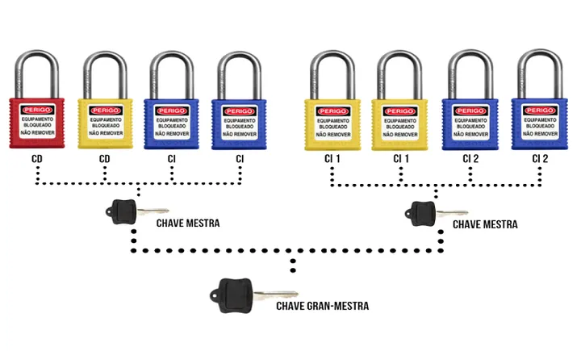

## Criptografia Assimétrica

Na outra sessão, expus que para um chat simples, ambos os usuários teriam de ter uma mesma chave para que a mensagem cifrada pudesse ser decifrada por ambos, usando a mesma mensagem da cifragem. Isso é um processo chamado criptografia simétrica, em que uma única chave é usada para cifrar e decifrar. Este tipo de criptografia tem suas desvantagens como o perigo de compartilhar a chave de criptografia, que pode ser minimizado utilizando o algoritmo Diffie-Hellman. Outro inconveninente é a complexidade da escalabilidade o gerenciamento de chaves pelo sistema massivo e impraticável para uma quantidade grande de usuários, quanto maior o número de usuários. Há uma outra dificuldade conhecida como `falta de não repúdio`. O que é isso? Uma vez que a chave é compartilhada, não há um método matemático de comprovar quem cifrou uma mensagem, tornando complicado o processo de atribuir uma mensagem a um usuário, este gerênciamento deve ser feito por outros métodos que não o reconhecimento da chave de cifragem.

Para amenizar tais situações, pensou-se em um processo mais seguro, e que a chave de decifragem não fosse compartilhado, que apenas um lado da comunicaçaõ a obtivesse. Este processo é um pouco mais lento que a criptografia simétrica, mas é mais seguro. É a `criptografia assimétrica`.

Agora cada usuário possui dois códigos um para cifragem e outro para decifragem. O código para cifragem pode ser público, qualquer um que tenha esta chave pode enviar uma mensagem, entretanto, a decifragem só é possível pelo destinatário.

**Por que é seguro**

Para a criação das duas chaves, utiliza-se da dificuldade matemática de fatorar números muito grandes compostos por dois primos.

**Como Funciona?**

Imagine que uma pessoa quer enviar um pacote para outra, mas quer ter certeza que apenas o destinatário possa abrí-lo. Vamos supor que este pacote seja uma caixa. Aí o remetente diz para o destinatário: "Manda pra mim um cadeado que só você tenha a chave". O remetente recebe o cadeado e trava a caixa com este cadeado, cadeado este feito de titânio que nenhum alicate possa quebrar, nenhum pé-de-cabra possa forçá-lo e que fosse à prova da utilização de artefatos que forcem o segredo, ou que a quantidade de pinos do segredo fosse tão grande que ninguém conseguisse usar um grampo de aço para cabelo.

Então o destinatário recebe a caixa e abre com a chave que apenas ele possui. Tá a análogia do cadeado é legal, mas e se mais de uma pessoa quiser enviar pacotes ao mesmo tempo? Aí é que está a coisa, o destinatário tem vários cadeados e possui uma chave mestra que abre todos eles, então, pode enviar o cadeado para trancar vários pacotes ao mesmo tempo e poderá abrir todos eles com a mesma chave gran-mestra.



Os cadeados podem ser compartilhados com qualquer um, desde que a chave seja de posse apenas do destinatário.

Esta é a diferença entre criptografia simétrica e assimétrica. Se o usuário "A" tiver chats com 1000 usuários diferentes, será necessário compartilhar 1000 segredos diferentes. Agora imagine os 1000 usuários podendo se comunicar entre si, quantas chaves serão necessárias?
$$\frac{1000 * (100-1)}{2}$$

E isso cresce a cada usuário, para ficar genérico pense que são "N" usuários então a quantidade de chaves que precisam ser gerenciados pelo sistema é:
$$\frac{N * (N-1)}{2}$$

Já na criptografia assimétrica cada usuário possui 2 chaves, uma para cifragem e outra para decifragem, a chave para cifragem não é segredo é pública então é a mesma chave enviada para todos os $"N-1"$ usuários do sistema, já a chave secreta é a mesma para qualquer mensagem recebida. Quanta economia de processamento e espaço em banco de dados, não é verdade?

## Mas como os pares de chaves são gerados?

Inicialmente 3 números são gerados aleatoriamente, vamos chamar esses números de *e*, *p* e *q*. O *e* é o número que fará parte da chave pública e *p* e *q* farão parte da chave privada.

Como fazer com que exista uma relação entre *e*, *p* e *q*?

Um número *n* é gerado e com ele é obtida a chave pública ao relacioná-lo com expoente *e*. Mas de onde surge esse *n* e de onde surge *e*?

Ao fazer $p \times q = n$, deste modo, *n* é um número composto, que podemos chamá-lo de número semiprimo, pois é  dependente de *p* e *q* dois números primos. Logo a chave pública e a chave privada estão relacionadas entre si.

A geração do expoente *e* segue um:

1 - Deve ser maior que 1 e menor que Totiente. `Totiente`? Sim, a função Totiente também é conhecida como função de Euler.

Esta função é definida como a quantidade de números inteiros co-primos com um número $n$ entre $1$ e esse $n-1$

Vou fugir aqui de uma explicação matemática mais profunda e vou direto a um exemplo que torne o conceito fácil de entender.

Por exemplo,

```Matemática
Suponha que queira encontrar a quantidade de coprimos de 8.
Então pegamos os números entre 1 e 8 e vejamos possuem como divisor comum apenas o 1.
```

Entenda o que são números coprimos com o exemplo abaixo:

8 e 9, apesar de serem números compostos, são copirmos entre si?
Chamaremos o conjunto dos divisores de 8 de $D_8$ e os divisores de 9 de $D_9$

Temos:
$$D_8 = { 1, 2, 4, 8}$$
$$D_9 = { 1, 3, 9 }$$

Para os conjuntos acima vemos que a interseção
$$D_8 \cap D_9 = {1}$$

A função $\phi$ ou Função de Eule (pronuncia-se Óiler) retorna a quantidade de números coprimos de n entre 1 e n.

Veja agora o cálculo da função phi para o número 8

| Par | É coprimo de 8? |
|:---:|:---:|
| 8 e 1 | Sim |
| 8 e 2 | Não, pois 2 é divisor de 8|
| 8 e 3 | Sim |
| 8 e 4 | Não, pois 4 é divisor de 8 |
| 8 e 5 | Sim |
| 8 e 6 | Não, pois 2 é divisor de 6 e 8|
| 8 e 7 | Sim |

Assim $\phi(8) = 4$

Um atalho, para n composto, $\phi(n) = \phi(p^k) = p^k - p^{k-1}$
O que esta notação significa?

$\phi(8) = \phi(2^3) = 2^3 - 2^{3-1} = 8 - 4 = 4$

Agora quando n for primo é o que importa para a criptografia RSA.

$\phi(n) = n - 1$

Agora finalmente sabemos como calcula-se *e* da chave pública.

Primeira regra, estar entre 1 e Totiente de n (que é o produto entre p e q)
Segunda regra, ser coprimo do Totiente.

Então para um exemplo válido, n deve ser o produto entre 2 números primos. Então supomos: p = 3 e q = 5. Desta forma n = 15;

$\phi(15) = (p - 1)(q - 1) = (3-1)(5-1) = 2 * 4 = 8$

Então a escolha para o expoente *e* precisa ser um número entre 1 e 8 que sejam coprimos, assim os possíveis números podem ser: {1, 3, 5, 7}, assim sendo o nº 3 pode ser a escolha para o expoente.

## Mas como uma mensagem é cifrada?

Para nossa mensagem de estudos vamos pensar em p e q números primos 233 e 347 respectivamente.

| chave pública | mensagem | chave privada
| :---:|:---:|:---:|
| e = 3, n = 80851 | O (original) | p = 233
| | C (cifrada)|  q = 347 |

Para esses valores encontramos um $\phi(n) = \phi(80851) = 80272$

**A escolha do expoente *e***:

O número 3 funciona, pois o Máximo Divisor Comum entre 3 e 80272 é 1.

**Cálculo da mensagem cifrada**
$$O^e mod (n) \equiv C$$

**Cálculo da mensagem decifrada**
$$C^d mod (n) \equiv O$$

Agora vamos conhecer aqui a tabela ASCII, pois a mensagem original e a mensagem decifrada utilizarão a mesma tabela, para os cálculos.


A tabela acima traz uma conversão dos bytes utilizados para representar cada caractere do idioma em números inteiros.
Vamos supor que a `Alice` quer enviar a mensagem "Oi" para o `Bob`, como essa mensagem será cifrada?

**O envio de mensagem**

Nós já sabemos que *e* e *n* compõem a chave pública e isso quer dizer que não é segredo para ninguém. Então Bob gera o *e* e o *n* e compartilha com Alice.

Do lado de Alice a mensagem oi é codificada da seguinte forma

| Mesagem original (O) | Mensagem original ASCII |
| :---: | :---: |
| O = 79 <br> i = 105 | Oi = 79105 |

Para cifrar Alice faz:
$$C = O^e (mod) 80851$$

$$C = 79105^3 (mod) 80851 \therefore C = 3790$$

Então Bob recebe a mensagem cifrada 3790.

Quando Bob recebe a mensagem cifrada de Alice faz o seguinte cálculo:

$$C^d (mod n)$$

Ué mas quem é *d*? Até agora não falamos dele. Mas matematicamente sabemos que:

$$ed \equiv 1(mod(p-1)(q-1))$$

sabemos também que $e = 3, p = 3, q = 5$
Então,
$$ed \equiv 1(mod(p-1)(q-1))$$
$$3d \equiv 1(mod(233-1)(347-1))$$
$$3d \equiv 1(mod(232)(346))$$
$$3d \equiv 1(mod(80272)) \implies 3d (mod(80272)) = 1$$

Qual número que multiplicado por 3 e dividido por 80272 deixa resto 1?

Ao proceder com este cálculo encontramos o valor de d.

Então se $$3d (mod(80272)) = 1 \therefore d = 53515$$

Assim sendo, $$ C^d (mod(80851)) $$ resulta na mensagem original.
$$3790^{53515} (mod(80851)) \equiv  79105$$

Veja que agora Bob lê 79105.

Mas aí fica a perqunta:

Como que 79105 vira Oi e não outra coisa?

Como sabe que deve agrupar os bytes?

A transformação em binário impede a confusão.

Por exemplo:

Oi Em bytes vira:

| Letra | Código ASCII | Binário |
| :---: | :---: | :---: |
| O | 79 | 0100 1111 |
| i | 105 | 0110 1001 |

Este agrupamento, quando trasnmitido informa ao receptor como ler 79105. Só a título de curiosidade 😉.

Agora entendemos como funciona o algoritmo RSA de criptografia assimétrica que é o padrão ouro atualmente de segurança de menagens atualmente.

### Mas como funciona o fluxo de comunicação e o "Aperto de Mão"?

**Uma nova analogia**

*Chave Pública*: Pense nela como uma caixa de correio que tem uma fresta e que qualquer um pode colocar uma mensagem por esta fresta.

*Chave Privada*: É a única forma de abrir a caixa de correio permitindo ler as mensagens que estão dentro dela.

#### Como o sistema sabe que alguém quer falar com você (O Handshake)

4 passos para iniciar uma sessão de comunicação segura;

```diagrama
[Usuário A]                                             [Usuário B]
    |                                                       |
    | 1. "Quero falar com você!"                            |
    |    (Identificação do Usuário)                         |
    |-------------------------------------------------------|
    |                                                       |
    | 2. Gera Chave AES, cifra com a Pública de Usuário B   |
    |-------------------------------------------------------|
    |                                                       |
    | 3. Gera Chave AES, cifra com a Pública de Usuário B   |
    |                    envia o "Segredo Cifrado"          |
    |-------------------------------------------------------|
    |                                                       |
    | 4. Usuário B Decifra mensagem com a chave privada.    |
    |    pronto! Ambos usam o AES a partir daqui.           |
    v                                                       v
```

1. Perceba que no primeiro passo o usuário A envia uma mensagem ao servidor ou diretamente ao usuário B.
2. **O envio da chave pública**: uma vez que a chave públicação é segredo, o sistema simplesmente responde ao usuário A: Olá Usuário A, aqui está a chave públics RSA (em formato de texto limpo, geralmente um padrão chamado PEM)".
3. **O Desafio/Segredo**: O RSA é pesado computacionalmente para mensagens longas, então um recurso interessante para mensagens longas é usar a cifragem AES, então o Usuário A, recebe a chave pública do Usuário B, cifra a mensagem com essa chave pública RSA, mas cria uma chave AES temporária (chave de sessão)e envia junto com a mensagem cifrada com a chave pública RSA do usuário B, somente o usuário B consegue decifrar essa mensagem, obter a chave AES do usuário A e ao invés de continuarem a conversa com o protocolo RSA, conversam com a chave compartilhada AES que é mais rápido. Imagina que você quer enviar teu número de documento para alguém e coloca este número dentro de uma caixa de correio da pessoa que só ela pode abrir, com este procedimento você pode compartilhar qualquer segredo, pois aí está um canal seguro de comunicação.
4. **O aperto de mão se completa**: Agora quando o usuário B recebe o pacote e só a chave privada dele consegue abrir esse pacote, o usuário B obtém a chave AES do usuário A e a partir desse momento ambos passam a conversar usando AES. Detalhe, não foi necessário todo os processo do algoritmo Diffie-Hellman para compartilhamento do segredo. A própria chave RSA do usuário B, foi usada para guardar o segredo trafegado pela rede.

## Implementando RSA em Python

Para isso, assim como foi na criptografia simétrica, vamos usar a biblioteca `cryptography`, que é o padrão da indústria de segurança em Python.
 ⚠️Evite o uso da biblioteca antiga e descontinuada `pycrypto`.

1º Passo: instalar a biblioteca a ser usada, caso ainda não o tenha feito no ambiente de desenvolvimento:

```python
# primeiro verifique se a lib está instalada com o comando:
pip list

# caso cryptography não estiver na lista então proceda com o comando a seguir
pip install cryptography
```

Agora é a hora de importar o RSA no script

```python
from cryptography.hazmat.primitives.asymmetric import rsa

# ============================================
# PASSO 1: Gerar o par de chaves do usuário B
# ============================================

# ⚠️ Gerar a chave privada. O expoente padrão ouro é 65537.
# 2048 bits é o tamanho mínimo 

chave_privada_usuario_b = rsa.generate_private_key(
    public_exponent=65537,
    key_size=2048
)

# A partir da chave privada, extraímos a pública
chave_publica_usuario_b = chave_privada_usuario_b.public_key()


# ======================================================
# PASSO 2: Exportando a Chave Pública para Texto (PEM)
# É assim que enviamos pela rede sem medo!
# ======================================================

pem_publico = chave_publica_usuario_b.public_bytes(
    encoding=serialization.Encoding.PEM,
    format=serialization.publicFormat.SubjectPublicKeyInfo
)

print("--- CHAVE PÚBLICA (pode enviar para qualquer um) ---")
print(pem_publico.decode("utf-8"))
print("-----------------------------------------------------\n")

# ======================================================================
# PASSO 3: O Usuário A recebe a chave do usuário B e cifra uma mensagem
# ======================================================================

# Simulando que o Usuário B recebeu o texto 'pem_publico' e o carregou na memória
chave_publica_recebida_por_usuario_b = serialization.load_pem_public_key(pem_publico)

mensagem_do_usuario_a = b"Segredo super confidencial: A chave AES da nossa sessão eh 42."

# Usuário A cifra a mensagem usando sua chave pública
# Usamos o OAEP com SHA-256, que adiciona aleatoriedade (padding) para evitar ataques.
mensagem_cifrada = chave_publica_recebida_por_usuario_a.encypt(
    mensagem_usuario_a,
    padding.OAEP(
        mgf=padding.MGF1(algorithm=hashes.SHA256()),
        algorithm=hashes.SHA256(),
        label=None
    )
)

print(f"Mensagem cifrada trafegando na rede (Ilegível): {mensagem_cifrada.hex()[:60]}...\n")

# ======================================================================
# PASSO 4: Usuário B recebe a cifragem com sua chave privada
# ======================================================================

mensagem_cifrada = chave_privada_usuario_b.decrypt(
    mensagem_cifrada,
    padding.OAEP(
        mgf=padding.MGF1(algorithm=hashes.SHA256()),
        algorithm=hashes.SHA256
    )
)
```

O Algoritmo RSA é bom demais no que diz respeito à segurança, entretanto, as chaves são grandes o que torna o processamento mais lento e utiliza muito recurso computacional. Atualmente há outro algoritmo de criptografia assimétrica que utiliza chaves muito menores tornando o algroritmo fortemente indicado para sistemas com pouco recurso computacional como IoT e mobiles, é a respeito deste algoritmo que vou escrever a partir de agora.

## ECC - Ellipits Curves Cryptograpy (Criptografia de Curvas Elípticas)

Para despertar o teu interesse em aprender ECC e começar a usar em suas aplicações já vou fazendo algumas comparações com RSA

#### RSA x ECC

| Característica | RSA | ECC | Quem Ganha? |
| :---|:---:| :---: |---:|
| Tamanho Chave |Grande (2024 a 4098 bits) | Pequena (256 a 384 bits) | ECC (chaves menores)|
| Velocidade de Cifragem | Muito rápida | rápida | RSA |
| Velocidade Decifragem | Lenta/Pesada | Muito rápida | ECC |
| Consumo de Banda/Memória | Alto (Pacotes maiores)| Muito Baixo | ECC |
| Compatibilidade Legada | universão (sistemas antigos) | Alta (mas não universão) | RSA |

#### Nota de Segurança

Uma chave ECC de 256 bits oferece o mesmo nível de segurança que uma chave RSA de 3072 bits. Isto significa menos dados trafegando na rede e menos processamento para dispositivos `IoT`, `Móveis` e `Sistemas Embarcados`.

Outra boa notícia, para aplicações de Chat, o compartilhamento da chave pública também pode acontecer por meio do algoritmo Diffie-Hellman com Curvas Elípticas - ECDH.

*Uma outra vantagem do algoritmo ECC em relação ao RSA*: Como as chaves são trocadas constantemente há a garantia de que mensagens antigas não sejam lidas mesmo se o aparelho for invadido no futuro (Forward Secrecy).

### Matemática por trás do ECC

#### O Fluxo do Handshake ECC (ECDH)

1. O usuário A envia sua Chave Pública Elíptica (CPE) ao usuário B;
2. O usuário B, em vez de cifrar algo, gera seu próprio par de chaves elipticas temporárias e envia sua Chave Pública Elípitca (CPE) para o usuário A;
3. **A mágica:** Agora o usuário A pega a CPE do usuário B + sua própria Chave Privada e calcula um ponto na curva. O usuário B faz o mesmo com a CPE do usuário.
4. A partir desse ponto indêntico gerado em ambos os lados, eles derivam a chave AES.

**Vantagem Crucial:** Se um hacker interceptar tudo na rede (as duas CPEs), não consegue calcular o ponto comum.

Agora fica a tua pergunta: O que é esse ponto Comum?

#### Como funciona a Matemática no ECC?

No RSA, a matemática é baseada na aritmética modular com números primos enormes ($n = p \times q$)

No ECC, não se utiliza a fatoração, mas a geometria de curvas elípticas sobre **corpos finitos**.

**Equação padrão de uma curva elíptica**

$$y^2 = x^3 + ax + b$$

Caso seja plotado um gráfico desta equação no plano cartesiano bidimensional, obtém-se uam curva simétrica em relação ao eixo X.

**Operação Abstrada: Adição de Pontos**

A segurança do ECC baseia-se no ponto de que é possível definir uma operação matemática de "adição de Pontos" na curva, traçar uma reta por esses pontos e encontrar um terceiro ponto na curva, rebater esse terceiro ponto no eixo $X$ e o resultado é o ponto R: $P + Q = R$.

Detalhe interessante: Se somar um ponto P com ele mesmo, estamos traçando uma reta tangente ao ponto P. Ou seja é possível ao invés de escolher dois pontos distintos traçar a tangente a um único ponto e obter: P + P = 2P (multiplicação escalar).

Agora utilizamos o problema do Logaritmo Discreto em Curvas Elípticas (ECDLP). A criptografia acontece quando é escolhido um **Ponto Gerador (G)**.

**Chave Privada** é simplesmente um número inteiro aleatório gigantesco em bits que chamaremos de `k`.

**Chave Pública `(K)`** é o ponto resultante de somar o ponto *G* a ele mesmo *k* vezes:
$$K = k \times G$$

Aqui mora o segredo da engenharia de segurança:

- Se eu te der o número k (chave privada) e o G, é extremamente fácil e rápido para o computador calcular o ponto final K. Importante você lembrar que G é um ponto no plano e possui coordenadas (x, y), k é um número inteiro em bits.
- Entretanto, se eu te der G e K **é matematicamente impossível** até para computadores atuais, decobrir quantas vezes o ponto  G foi somado $(k)$. Não existe "divisão" de pontos na curva elíptica. A única forma de descobrir o k seria  testar um número por um por força bruta que levaria bilhões de anos.

Para impedir que os pontos fiquem infinitos e usem casas decimais absurdas, toda essa matemática é calculada usando **módulo primo** $p$ (Corpos Finitos).

Para a geração do segredo AES ambos os lados da comunicação cooperam ativamente.

### Exemplo Prático Comunicação de Alice e Bob

Para o mundo real as curvas seguras e padronizadas já foram escolhidas:

- Curvas NIST
- Curve25519 (projetado para uso com o esquema de acordo de chave ECDH)
- secp256k1 (suado em Bitcoin e outras criptomoedas)
- Curvas de Brainpool (oferece uma alternativa às curvas NIST)

**Observação** Você usa chave ssh do github para subir seus commits? você já reparou que a transmissão dos dados para o github os dados são criptografados utilizando a curva25519?

Quando fizer o push que for pedido para digitar a senha, observe a instrução que aguarda sua senha:

```bash
Enter passphrase for key '/c/Users/.../.ssh/id_ed25519': # é isso mesmo $id_ed25519
```

**Importante:** Não tente criar do zero a sua curva de criptografia, isso pode gerar vulnerabilidades em seu algoritmo de segurança.

Como as duas curvas mais famosas são: secp256k1 (blockchain) e X25519 (IoT e WhatsApp), vamos usar em nosso exemplo a X25519.

Primeiro vamos simular o Handshake entre Alice e Bob.

Configuração Pública:
Alice gera uma chave pública e Bob gera outra.

- Uma curva elíptica qualquer
- Ponto Gerador (G): É um ponto específico na curva (ex: coordenadas x=5, y=3).

**Passo 1:** Geração das Chaves

**Alice cria suas chaves:**

- Ela escolhe um número secreto aleatório (sua chave privada $k_A$)
$$k_A = 4$$

- Calcula a sua chave pública ($K_A$), que significa somar o ponto G a ele mesmo 4 vezes.
$$K_A = 4 \times G$$

- Ela envia o ponto $K_A$ para Bob.

**Bob cria suas chaves:**

- Escolhe o próprio número secreto aleatório (chave privada $k_B$)
$$k_B = 7$$

- Calcula sua chave pública:
$$K_B = 7 \times G$$

- Bob envia sua chave pública para Alice.

Supondo que um hacker intercepte esta comunicação ele sabe o $K_A$, $K_B$, o $G$ mas não sabe os números secretos $k_A$ e $k_B$. Então de nada adianta.

**Passo 2:** Calculo do segredo compartilhado (AES)

- Alice faz:
$$Segredo = k_A \times K_B$$
$$Segredo = 4 \times (7 \times G)$$
$$Segredo = 28 \times G$$

- Bob faz:
$$Segredo = k_B \times K_A$$
$$Segredo = 7 \times (4 \times G)$$
$$Segredo = 28 \times G$$

Ambos chegaram exatamente no mesmo ponto na curva: $28 \times G$ (o ponto G somado 28 vezes).

Para finalizar, tempos o ponto com coordenadas x e y. Pegam, por exemploz apenas a coordenada x, que é uma sequência de bits, jogam em uma função de hash (como SHA-256) e pronto, temos a chave simétrica AES para usar no chat.

Agora escovando um pouco os bits para a chave simétrica AES.
Há uma estrutura específica, para impedir que hackers explorem fraquezas, os 256 bits da chave privada $k$ passam por uma limpeza, um processo de `clamping` antes de serem usados:

- o bit mais significativo é forçado a ser `1`;
- os 3 bits menos significativos são forçados a ser `000`.

Isso significa que a chave privada $k$ é um número que o bit mais à esquerda é sempre `1` seguido de 252 bits aleatórios, concluído com 3 bits à direita que são sempre `000`.

```plaintext
  byte 1     byte 2        byte 31    byte 32
[1#######] [########] ... [########] [#####000]
 ^                               ^
 |                               |
 Bit mais significativo       3 bits menos significativos
```

## Como aplicar isso?

Olha só que legal, pode usar a própria biblioteca Python `cryptography` para isso, logo a seguir mostrarei um código simples para teste.
