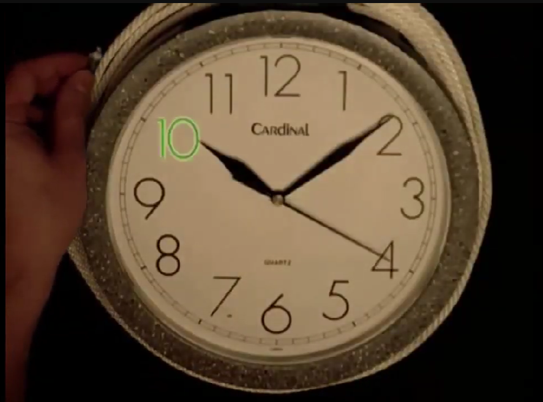

## Um Pouco de História

Iniciando por entender o que é criptografia, eu fui curiosamente observer de onde surgiu a ideia e os casos de uso que datam desde a antiguidade. Há quanto tempo as pessoas têm segredos que querem manter deste modo de outras pessoas. Mas que tais mensagens possam ser alcançadas a pessoas de interesse.

A criptografia nada mais é que o ato de embaralhar um conteúdo utilizando uma sequência lógica de ações que pode ser revertida. Se a criptografia não puder ser revertida, não há nenhum sentido uma vez que o conteúdo será perdido por completo, deste jeito, melhor seria descartá-lo.

Eu vi os primeiros sinais no Egito com os hieroglifos, que consistia na substituição de letras ou palavras por figuras, para que os segredos permanecessem ocultos. E há outros exemplos na história, que para este trabalho não faz sentido detalhar, terei um documento anexado a este repositório com mais detalhes a quem possa interessar.

Anterior à era dos computadores havia métodos de criptografia como a dos egípcios ou como a cifra de César que nada mais era que substituir um caracter por outro, e esta substituição era bem simples e fácil de quebrar. Um caractere era substituído por outro encontrado três posições à sua frente no alfabeto ou sequência.

Exemplo da Cifra de César:

A palavra criptografia viraria fumsxrjudimd

Uma das mais simples técnicas de criptografia.

Após algumas evoluções no processo de criptografia foi-se inserida a ideia de chave criptográfica. Uma forma de tornar, mesmo o método de substuição mais complicado, sendo possível a decifragem da mensagem apenas em posse de uma chave.

Vemos muitos filmes que para a mensagem ser decifrada a chave está espalhada por um livro. Como era a cifra de Ottendorf?

Primeiro o destinatário tem de ter acesso ao mesmo livro que o remetente e a edição exata do livro. Então a cifra é uma sequência numérica da número da página (np), número da linha (nl), posição da palavra na linha, contando da esquerda para a direita (pp).

Formato do Código: 121.7.5: Página 121, linha 7, palavra 5.

Pontos Fortes da cifra de Ottendorf:

- Resistência à força bruta: não há uma chave matemática para quebrar o código. O hacker precisaria saber qual é o livro físico e a edição do livro para conseguir decifrar o código.

- Segurança: Por conta da obscuridade a mensagem parece apenas um monte de números aleatórios. Se o atacante nem mesmo souber que se trata de uma cifra de Ottendorf os números jamais terão um significado e depois de descobrir que se trata de tal técnica, ainda teria de descobrir o livro e a edição.

Mas qual é o ponto fraco?
Não muito raro as mensagens possuem palavras comuns, como as preposições e artigos, e assim há a vulnerabilidade a padrões. Outro ponto fraco é a dependência total, se o destinatário perder o exemplar do livro a mensagem está completamente inutilizada, sendo impossível decifrar.

Com a invenção das cifras eletrônicas como a máquina enigma, foi possível criar chaves mais fortes e criptografias mais poderosas. Mas como sabemos qualquer corrente é tão forte quanto o seu elo mais fraco, no caso da enigma, a sua dependência de pessoas criarem suas chaves, tornou-a factível de falhas, pois as pessoas tendem a repetir padrões e aí o analista muito atento e experiente poderá quebrar a mensagem por observar o histórico. Para mais detalhes a respeito disso aconselho o leitor a assistir aos filmes: Enigma - O jogo da Imitação (2014) e Enigma (2001).

Depois disso, a Enigma foi só evoluindo e os métodos de criptografia também. Atualmente com o uso dos computadores, as tecnicas de criptografia estão poderosíssimas, beirando o impossível de quebra. Por que digo 'beirando o impossível'? Porque não sabemos como isso irá ficar com o advento da computação quântica.

## Um pouco da matemática

Atualmente, há uma forma de criptografia aceitavelmente segura que é a criação de uma única chave criptográfica para cifrar e decifrar uma mensagem. Assim como eram os métodos criptográficos mais antigos, a mesma chave para embaralhar a mensagem, deve ser usada para desembaralhar.

A comunicação on line, contudo, se mostra insegura para transportar a chave, uma vez essa mensagem sendo interceptada, o atacante terá acesso a todo conteúdo trafegado, não é verdade? Então como fazer o destinatário saber a chave usada pelo remetente sem que a segurança da informação seja comprometida?

Há um método chamado Diffie-Hellman que é a melhor solução que eu conheço. Perceba que eu não disse que é a melhor solução que existe, mas que eu conheço, se você conhece outras soluções e melhores, manda aqui para que eu possa pesquisar.

O método utilizar o conceito de relógio modular.
Imagine que você quer calcular 46 mod 12. Então você pega uma corda de 46 unidades de comprimento, e enrola em volta de um relógio dividido em 12 unidades, o lugar onde a ponta da corda parar é o resultado

Neste caso a solução e 10, então

$\ 46 \mod 12 \equiv 10$

Mas fica parecendo que só pode ser usado o relógio de 12h, mas na verdade você pode usar o conceito de módulos primos, em que o relógio será do tamanho de algum número primo, como por exemplo 17. Precisamos calcular a `raiz primitiva` de 17, que não é 4, pois não estamos falando de raiz quadrada. A Raiz primitiva é um número que se elevarmos a diferentes expoentes, e calculando o resultado pelo módulo de 17, encontramos os diferentes números do relógio sem que haja repetição até a conclusão da primeira volta. E como calculamos a volta? Pelos expoentes. vamos ver o exemplo do 17?

As horas do relógio com 16 horas vai de 1 até 16, o 17 vira 0.

Dizemos que um número $g $ é raiz primitiva de 17, se quando começarmos a elevar esse número a potências sucessivas $\ (g^1, g^2, g^3, g^4, ..., g^{16}) $, o resto da divisão por 17 passar por todos os números de 1 a 16 sem repetir nenhum, até dar a volta completa.

- $ 3^1 mod 17 = 3$, pois o resto da divisão 3/17  é  3
- $ 3^2 mod 17 = 9$
- $ 3^3 mod 17 \rightarrow (27-17)$ resto 10
- $ 3^4 mod 17 \rightarrow ( 81 \div 17 )$ dá 4 voltas e sobra 13, resto 13
- $ 3^5 = 243 \rightarrow $ resto 5
- $ 3^6 = 729  \rightarrow $ resto 15
- $ 3^7 = 2.187 \rightarrow $ resto 11
- $ 3^8 = 6.561 \rightarrow $ resto 16
- $ 3^9 = 19.683 \rightarrow $ resto 14
- $ 3^{10} = 59.049\rightarrow $ resto 8
- $ 3^{11} = 177.147 \rightarrow $ resto 7
- $ 3^{12} = 531.441 \rightarrow $ resto 4
- $ 3^{13} = 1.594.323 \rightarrow $ resto 12
- $ 3^{14} = 4.782.969 \rightarrow $ resto 2
- $ 3^{15} = 129.140.163\rightarrow $ resto 3
- $ 3^{16} = 43.046.721\rightarrow $ resto 1

Outra caracterírtica é que $ g^{p-1} mod$ p $ \equiv 1 $

Esta característica de não ter uma forma direta de calcular a razi primitiva é que torna tal método tão atraente para usar em criptografia.

*Fantástico não é!!*

Importante frizar que um número primo pode possuir mais que uma raiz primitiva, entretanto, por enquanto utilizamos apenas a primeira raiz primitiva no processo de cifragem. Lembrando que estamos falando aqui do método Diffie-Hellman para compartilhamento de chaves públicas e secretas.

Agora que temos a raiz primitiva que também é chamada de `gerador` e o número primo 17, podemos começar o processo de compartilhamento de chave e criação da chave secreta.

Vamos supor que Eu (E) e Você (V) queremos começar a conversar no chat, para que ELE (ELE), kkk criativo não é? 😂. Não leia nossas mensagens precisamos dar um aperto de mãos para que a conversa fique apenas entre nós.

Olha como o processo é lindo.

Imagine que em uma paleta você misture tintas na cor azul e amarela, você obterá uma terceira cor, a verde. Como você faria para obter novamente as duas porções de amarelo e azul? 🤔. Não há como, é um caminho só de ida. Assim também é o problema do logaritmo discreto
